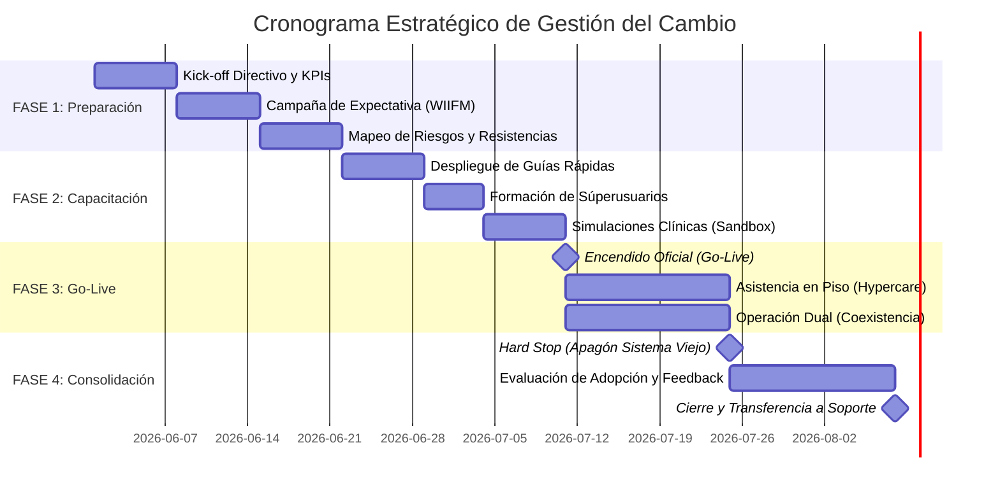

# Plan de Gestión del Cambio
## Estrategia para Reducir la Resistencia Cultural Durante la Implementación Tecnológica

---
## Resumen Ejecutivo
Este plan tiene como objetivo facilitar la adopción de nuevas tecnologías dentro de la organización, reduciendo la resistencia al cambio mediante capacitación, comunicación y acompañamiento operativo.

---

## 1. Introducción 
Este documento constituye el **Plan General de Gestión del Cambio** diseñado para acompañar la implementación de nuevas plataformas tecnológicas, sistemas de software o reingenierías de procesos dentro de la organización. 

### Objetivos del Plan

- Reducir la resistencia cultural.
- Facilitar la adopción tecnológica.
- Capacitar a los usuarios.
- Mejorar la transición operativa.

---

## 2. Matriz de Gobernanza: Roles y Responsabilidades
Para que el cambio sea exitoso, la estructura de liderazgo debe estar definida antes de iniciar la ejecución:

* **Sponsor Ejecutivo (Alta Gerencia):** Máxima autoridad del proyecto. Modela la cultura de adopción, autoriza los presupuestos de infraestructura/capacitación y legitima el mandato del cambio organizacional.
* **Project Manager / Líder del Proyecto:** Orquesta la ejecución de las fases técnicas y humanas, coordina la comunicación interdepartamental y monitorea el cumplimiento de los hitos del Roadmap.
* **Equipo Técnico / Ingenieros de Software:** Proveen estabilidad en los entornos, corrigen bugs reportados de forma ágil y aseguran el correcto flujo de las API y bases de datos durante la fase de transición.
* **Superusuarios (Champions):** Operadores seleccionados estratégicamente en piso por su empatía y habilidad técnica. Actúan como el primer punto de contacto para resolver dudas de sus pares, reduciendo el cuello de botella en el área de sistemas.
* **Usuarios Finales:** Ejecutan los procesos, atienden los talleres de simulación y reportan retroalimentación constructiva sobre la experiencia de usuario (UX).

---

## 3. Identificación de Resistencias Culturales y Operativas
Antes de iniciar cualquier proceso de transición, se diagnostican las barreras típicas que surgen en los equipos operativos para poder neutralizarlas:

* **Incertidumbre y Miedo al Reemplazo:** Temor intrínseco de los colaboradores a que la automatización o la Inteligencia Artificial vuelvan obsoletos sus puestos de trabajo.
* **Resistencia por Sobrecarga Cognitiva:** Frustración inicial causada por la necesidad de aprender nuevas interfaces, flujos de trabajo o comandos, alterando la zona de confort.
* **Desconfianza en la Estabilidad de la Herramienta:** Preferencia por métodos analógicos o legacy tradicionales ("siempre se ha hecho así y funciona").
* **Fricción por Políticas de Dispositivos (BYOD / Corporate):** Incomodidad en caso de requerir el uso de smartphones personales o nuevas restricciones de acceso en equipos corporativos.

---

## 4. Estrategia de Gestión del Cambio (Modelo ADKAR)
La gestión humana del cambio se estructurará bajo las cinco dimensiones del modelo **ADKAR** de Prosci:

### 4.1. Conciencia (Awareness)
* **Meta:** Explicar con transparencia absoluta el "Por qué" del cambio.
* **Estrategia:** Reuniones de alineación (Kick-off) lideradas por la alta dirección donde se expongan los riesgos de la inacción y cómo el nuevo software resolverá problemáticas de fondo.

### 4.2. Deseo (Desire)
* **Meta:** Fomentar el interés individual mediante el concepto *WIIFM* (*What's In It For Me* / ¿Qué gano yo?).
* **Estrategia:** Demostraciones de la reducción de carga laboral manual. El software debe presentarse como un aliado que automatiza tareas repetitivas, no como un reemplazo.

### 4.3. Conocimiento (Knowledge)
* **Meta:** Proveer las herramientas cognitivas necesarias para la operación.
* **Estrategia:** Creación de micro-cápsulas de video y guías visuales de una sola página (*One-pagers*). Se prohíbe la distribución de manuales extensos para usuarios finales.

### 4.4. Habilidad (Ability)
* **Meta:** Desarrollar la destreza operativa real en entornos controlados.
* **Estrategia:** Implementación de un ambiente de pruebas (*Sandbox*) donde el usuario pueda experimentar sin afectar la base de datos de producción, apoyado por los *Champions*.

### 4.5. Refuerzo (Reinforcement)
* **Meta:** Anclar el cambio y evitar la regresión a los hábitos antiguos.
* **Estrategia:** Ejecución del *Hard Stop* (apagón definitivo del sistema antiguo). Medición y celebración de victorias tempranas y apertura de canales de mejora continua directa.

---

## 5. Roadmap Visual de Implementación

## 6. Matriz de Ejecución y Hitos Críticos

| Fase Temporal | Hito Crítico (Milestone) | Entregables y Acciones Clave | Responsable Principal |
| :--- | :--- | :--- | :--- |
| **Fase 1: Preparación** |  **Kick-off Directivo** | • Definición de metas de negocio y KPIs de adopción. • Identificación y reclutamiento de Champions (Líderes de opinión). • Campaña de comunicación interna. | Alta Dirección / Project Manager |
| **Fase 2: Capacitación** |  **Apertura de Sandbox** | • Distribución de infografías y materiales interactivos ágiles. • Capacitación especializada al equipo de Superusuarios. • Talleres prácticos y simulacros en ambiente seguro. | Líder de TI / Recursos Humanos |
| **Fase 3: Transición** |  **Lanzamiento (Go-Live)** | • Despliegue técnico definitivo a producción. • Despliegue de soporte técnico y humano en piso (Hypercare). • Monitoreo de operación dual (flujo anterior y nuevo en paralelo). | Equipo de Desarrollo / Superusuarios |
| **Fase 4: Consolidación**|  **Hard Stop (Apagón)** | • Cierre total, retiro de papelería o bloqueo de accesos al sistema anterior. • Recolección de métricas de adopción y retroalimentación de usabilidad. • Reconocimiento de equipos destacados y pase a mantenimiento. | Project Manager / Gerentes de Área |

---

## 7. Gestión de Riesgos y Matriz de Contingencia

| Riesgo Humano / Técnico | Probabilidad | Impacto | Estrategia de Mitigación / Contingencia |
| :--- | :--- | :--- | :--- |
| **Boicot Pasivo (Negativa implícita a usar la app)** | Media | Alto | Reforzar las sesiones WIIFM con mandos medios. Identificar al líder informal del boicot e integrarlo al comité de pruebas para darle voz y voto. |
| **Brecha Tecnológica Severa (Ansiedad Digital)** | Alta | Medio | Implementar sesiones personalizadas de mentoría uno a uno con los Superusuarios y simplificar la interfaz gráfica (GUI). |
| **Saturación o Bugs Críticos en el Día del Go-Live** | Baja | Crítico | **Plan de Rollback:** Mantener la infraestructura del sistema anterior activa pero en modo de solo lectura durante las primeras 72 horas. |
| **Rechazo a Políticas BYOD (Hardware Personal)** | Baja | Alto | Establecer estaciones o terminales físicas fijas propiedad de la empresa para eliminar la obligatoriedad del uso de dispositivos personales. |

---

## 8. Indicadores Clave de Rendimiento (KPIs)

Para cuantificar la efectividad de la transición, se medirán los siguientes indicadores numéricos:

1. **Tasa de Adopción de la Plataforma:** (Usuarios activos en el nuevo sistema / Total de usuarios capacitados) x 100 (Meta: > 95% al finalizar la Fase 3).
2. **Eficiencia Operativa:** Reducción porcentual del tiempo de ejecución operativa en comparación con el método analógico anterior (Meta: Reducción >= 50%).
3. **Índice de Errores en Producción:** Número de registros erróneos o tickets de soporte levantados por confusión de interfaz en piso (Meta: < 5% semanal).
4. **Tasa de Regresión:** Intentos registrados de evadir la plataforma oficial para usar métodos tradicionales (Meta: 0% post Hard Stop).

---

## 9. Conclusión de la Metodología

Una implementación tecnológica exitosa no concluye cuando el código pasa a producción. La verdadera estabilidad del software radica en la apropiación que los usuarios hagan de él. Al estructurar la transición humana con fases lógicas (ADKAR), herramientas ágiles de aprendizaje y puntos claros de corte (Hard Stop), la organización transforma un riesgo cultural en un caso de éxito operativo.
